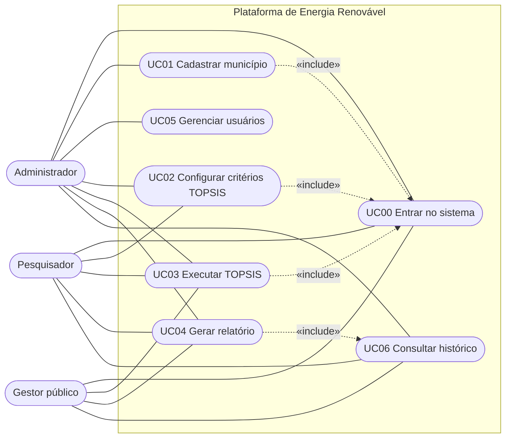

# Diagrama de casos de uso

Mermaid não tem um tipo nativo de casos de uso; o diagrama usa `flowchart` com os atores à esquerda.

O roteiro associa o UC04 ao gestor; na implementação, qualquer usuário autenticado pode gerar relatórios.

## Descrição dos casos de uso

### UC00 · Entrar no sistema
- **Atores:** todos.
- **Fluxo principal:** informa e-mail e senha → o sistema confere o hash bcrypt → devolve um token JWT → o usuário acessa o painel.
- **Fluxo alternativo:** credenciais inválidas → mensagem "E-mail ou senha incorretos." (sem indicar qual dos dois está errado).

### UC01 · Cadastrar município
- **Ator:** administrador. **Pré-condição:** usuário autenticado.
- **Fluxo principal:** 1. envia os dados (nome, UF, população, IDH, coordenadas) → 2. o sistema valida → 3. persiste → 4. confirma com 201.
- **Alternativo:** dados inválidos (por exemplo, UF com mais de 2 letras) → 400 com mensagem clara.
- **Observação:** hoje o cadastro é feito pela API (`POST /api/municipios`, também pelo Swagger).

### UC02 · Configurar critérios TOPSIS
- **Atores:** pesquisador e administrador.
- **Fluxo principal:** define o tipo (benefício ou custo) e o peso de cada critério; a soma dos pesos deve ser 100%.

### UC03 · Executar TOPSIS
- **Atores:** pesquisador, gestor e administrador.
- **Fluxo principal:** seleciona o conjunto de dados → executa → o sistema calcula e **grava a simulação** → exibe o ranking, o gráfico e o mapa.

### UC04 · Gerar relatório
- **Atores:** gestor, pesquisador e administrador.
- **Fluxo principal:** escolhe uma simulação do histórico ou a última executada → exporta em PDF ou CSV.

### UC05 · Gerenciar usuários
- **Ator:** administrador.
- **Fluxo principal:** cria usuários, altera nome, perfil ou senha e exclui usuários. Não pode excluir nem rebaixar a si mesmo.

### UC06 · Consultar histórico
- **Atores:** todos autenticados.
- **Fluxo principal:** abre o painel "Histórico de simulações" e baixa o relatório de qualquer execução.
