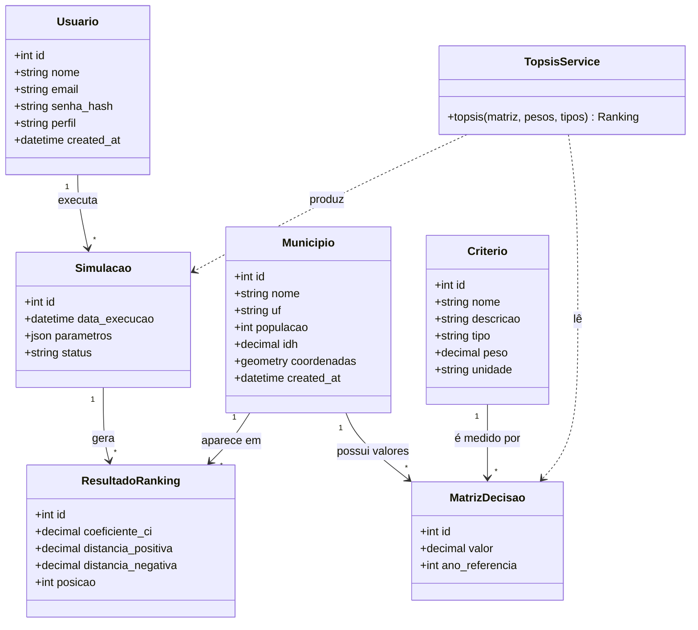

# Diagrama de classes (modelo de domínio)

Reflete as tabelas do banco (`backend/migrations/001_initial_schema.sql`). `Usuario` e o histórico são complementos ao diagrama do roteiro.

Valores possíveis: `Usuario.perfil` = `administrador`, `pesquisador` ou `gestor`; `Criterio.tipo` = `beneficio` ou `custo`. `TopsisService` é uma função pura (não depende do banco).
