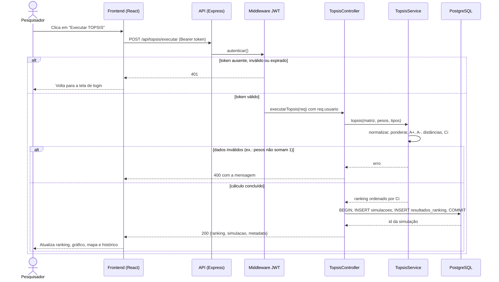

# Diagrama de sequência: executar o TOPSIS

O usuário que consta na simulação vem do token, nunca do corpo da requisição. Com `"salvar": false`, o controlador calcula e responde sem gravar no banco (usado ao abrir a página).
