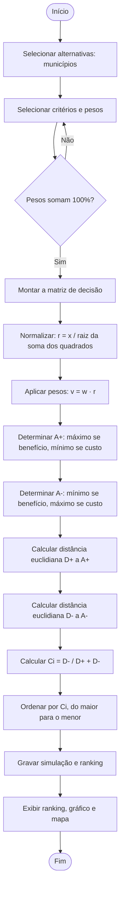

# Diagrama de atividades: fluxo do TOPSIS

```mermaid
flowchart TD
    inicio([Início]) --> alt[Selecionar alternativas: municípios]
    alt --> crit[Selecionar critérios e pesos]
    crit --> soma{Pesos somam 100%?}
    soma -- Não --> crit
    soma -- Sim --> matriz[Montar a matriz de decisão]
    matriz --> norm[Normalizar: r = x / raiz da soma dos quadrados]
    norm --> pond[Aplicar pesos: v = w · r]
    pond --> ap[Determinar A+: máximo se benefício, mínimo se custo]
    ap --> am[Determinar A-: mínimo se benefício, máximo se custo]
    am --> dp[Calcular distância euclidiana D+ a A+]
    dp --> dm[Calcular distância euclidiana D- a A-]
    dm --> ci[Calcular Ci = D- / D+ + D-]
    ci --> ord[Ordenar por Ci, do maior para o menor]
    ord --> salvar[Gravar simulação e ranking]
    salvar --> exibir[Exibir ranking, gráfico e mapa]
    exibir --> fim([Fim])
```
