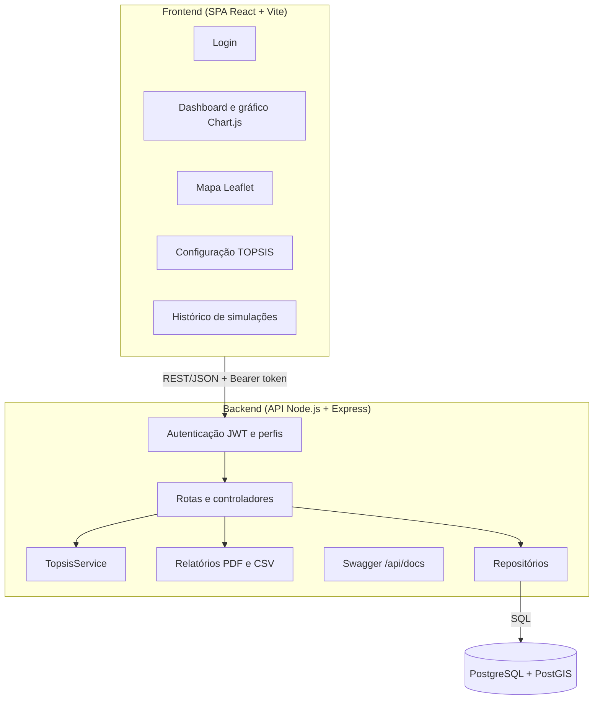

# Diagrama de componentes

```mermaid
flowchart TB
    subgraph FE["Frontend (SPA React + Vite)"]
        login[Login]
        dash[Dashboard e gráfico Chart.js]
        mapa[Mapa Leaflet]
        cfg[Configuração TOPSIS]
        hist[Histórico de simulações]
    end

    subgraph BE["Backend (API Node.js + Express)"]
        auth[Autenticação JWT e perfis]
        rotas[Rotas e controladores]
        topsis[TopsisService]
        rel[Relatórios PDF e CSV]
        docs[Swagger /api/docs]
        repo[Repositórios]
    end

    db[(PostgreSQL + PostGIS)]

    FE -- "REST/JSON + Bearer token" --> auth
    auth --> rotas
    rotas --> topsis
    rotas --> rel
    rotas --> repo
    repo -- SQL --> db
```
