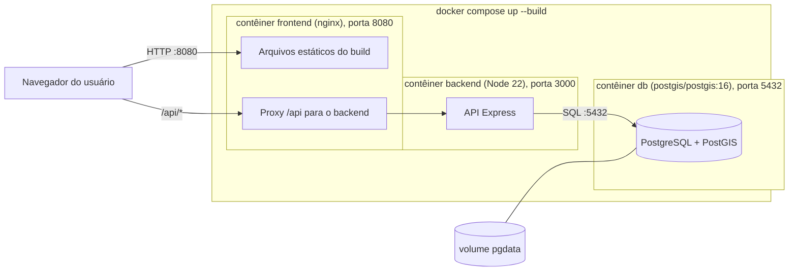

# Diagrama de implantação (Docker Compose)

Em produção, coloque um proxy HTTPS na frente do `frontend` e defina `JWT_SECRET`, `ADMIN_EMAIL` e `ADMIN_SENHA` próprios (os padrões do Compose são só para estudo).
