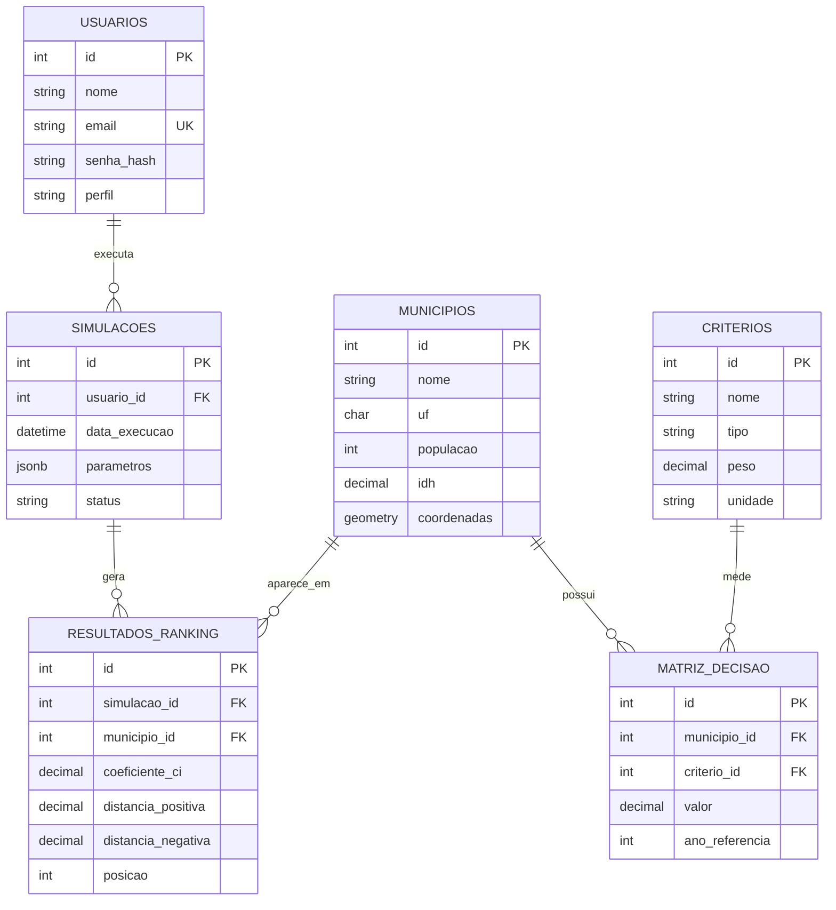

# Modelo entidade-relacionamento

```mermaid
erDiagram
    USUARIOS ||--o{ SIMULACOES : executa
    SIMULACOES ||--o{ RESULTADOS_RANKING : gera
    MUNICIPIOS ||--o{ RESULTADOS_RANKING : aparece_em
    MUNICIPIOS ||--o{ MATRIZ_DECISAO : possui
    CRITERIOS ||--o{ MATRIZ_DECISAO : mede

    USUARIOS {
        int id PK
        string nome
        string email UK
        string senha_hash
        string perfil
    }
    MUNICIPIOS {
        int id PK
        string nome
        char uf
        int populacao
        decimal idh
        geometry coordenadas
    }
    CRITERIOS {
        int id PK
        string nome
        string tipo
        decimal peso
        string unidade
    }
    MATRIZ_DECISAO {
        int id PK
        int municipio_id FK
        int criterio_id FK
        decimal valor
        int ano_referencia
    }
    SIMULACOES {
        int id PK
        int usuario_id FK
        datetime data_execucao
        jsonb parametros
        string status
    }
    RESULTADOS_RANKING {
        int id PK
        int simulacao_id FK
        int municipio_id FK
        decimal coeficiente_ci
        decimal distancia_positiva
        decimal distancia_negativa
        int posicao
    }
```
